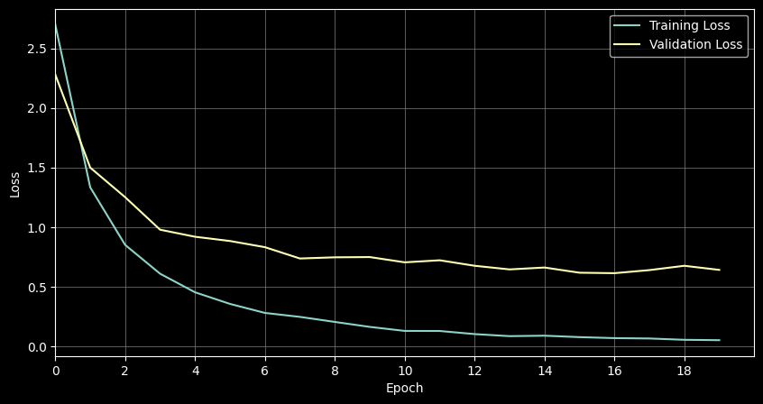

# Task 2: ID Classifier App

This application does ID document classification using CNN and LLM.
It consists of a frontend, backend, and model service.

## Prerequisites

- Docker
- OpenAI API key

## Quick Start

### 1. Set up your OpenAI API key

Create a `.env` file in the `model/inference` directory with your OpenAI API key:

```
OPENAI_API_KEY=your_openai_api_key_here
```

Never commit your API key to version control. The `.env` files are included in `.gitignore`.

### 2. Build and run with Docker

From the project root directory, run:

```
docker-compose up -d
```


### 3. Access the application

- Frontend: http://localhost:3000
- Backend API: http://localhost:5000
- Model Service: http://localhost:8000

## Development

### Service Architecture

- **Frontend (React)**: Provides the user interface for uploading and viewing ID documents
- **Backend (FastAPI)**: Handles file uploads and communicates with the model service
- **Model Service (FastAPI)**: Processes images and performs ID classification

### Project Structure

```
├── .gitignore                  
├── docker-compose.yaml
├── README.md                   
├── backend/                    # Backend API service
│   ├── app.py                  # Main FastAPI application
│   ├── config.py               
│   ├── Dockerfile              
│   ├── requirements.txt        
│   └── tmp/                    # Temporary directory for file processing
│
├── frontend/                   # Frontend React application
│   ├── Dockerfile       
│   ├── nginx.conf              # Server config
│   ├── package.json            # NPM dependencies
│   ├── build/                  # Production build
│   ├── public/                 # Public assets
│   └── src/                    # React source code
│       ├── App.css             # Main app styles
│       ├── App.js              # Main app component
│       └── ...                 # Other React components
│
└── model/                      # ML model service
    ├── .dockerignore           
    ├── config.py               
    ├── Dockerfile              
    ├── model_api.py            # FastAPI model endpoints
    ├── requirements.txt            
    ├── data/processed/         # Split training, validation and test data
    ├── inference/              # Model inference code
    │   ├── .env                # OpenAI API key
    │   ├── mobilenet_inference # CNN model inference implementation
    │   ├── openai_inference    # LLM inference code 
    ├── models/                 # Saved trained model
    │   ├── mobilenetv2_best.h5 # CNN model weights
    │   ├── class_indices.npy   # Class mapping indices
    └── training/               # Model training scripts and evaluation code
```

### Communication Flow

```
┌───────────┐      ┌────────────┐      ┌────────────┐     ┌────────────┐     ┌────────┐
│   User    │─────►│  Frontend  │─────►│  Backend   │────►│   Model    │────►│  CNN   │
│ (Browser) │      │   (React)  │      │  (FastAPI) │     │  Service   │◄────└────────┘
│           │◄─────│            │◄─────│            │◄────│ (FastAPI)  │────►┌────────┐
└───────────┘      └────────────┘      └────────────┘     └────────────┘◄────│  LLM   │
                                                                             └────────┘
```

1. User uploads an ID document through the frontend interface
2. Frontend sends the image to the backend API
3. Backend sends the image to the model service for classification
4. Model service uses async classification with CNN and LLM
5. Results are passed back through the chain to the user interface

## Troubleshooting

1. Verify your OpenAI API key
2. Ensure all ports are available


# MobileNetV2 CNN Model Report

## Architecture
- Frozen base model MobileNetV2 pretrained on ImageNet
- Input: 224 × 224 × 3
- GlobalAveragePooling2D
- Classification Head:
  - Dense layer (128 units, ReLU activation)
  - Dropout (0.5)
  - Output layer (10 units, Softmax activation)

## Training Configuration
- **Dataset**: Processed images in train/val/test directories 700/150/150
- **Image Size**: 224 × 224 pixels
- **Batch Size**: 35
- **Preprocessing**: scaling pixels from [0, 255] to [-1, 1] and image resizing
- **Optimizer**: Adam (lr=0.001)
- **Loss Function**: Categorical Cross-Entropy
- **Metrics**: Accuracy
- **Epochs**: 20
- **Callbacks**:
  - Early Stopping (patience=5, monitor='val_loss')
  - Model Checkpoint (monitor='val_accuracy', save best only)

## Training Process
- Transfer Learning Approach:
  - Frozen MobileNetV2 base for feature extraction
  - A classification head trained from scratch

## Results

### Training & Validation Loss

- Training loss: 0.0514
- Training accuracy: 0.9957
- Val loss: 0.6409
- Val accuracy: 0.7867


### Test Data Classification Report
- Test Loss: 0.58
- Test Accuracy: 0.79

```
                      precision    recall  f1-score   support

              alb_id       0.62      0.67      0.65        15
        aze_passport       0.88      0.93      0.90        15
              esp_id       0.67      0.93      0.78        15
              est_id       0.81      0.87      0.84        15
              fin_id       0.75      0.20      0.32        15
        grc_passport       0.86      0.80      0.83        15
        lva_passport       0.87      0.87      0.87        15
rus_internalpassport       1.00      0.80      0.89        15
        srb_passport       0.70      0.93      0.80        15
              svk_id       0.81      0.87      0.84        15

            accuracy                           0.79       150
           macro avg       0.80      0.79      0.77       150
        weighted avg       0.80      0.79      0.77       150
```

### Confusion Matrix
```
[[10  0  3  0  0  0  0  0  1  1]
 [ 0 14  0  1  0  0  0  0  0  0]
 [ 0  0 14  0  0  0  0  0  0  1]
 [ 0  0  0 13  1  0  0  0  1  0]
 [ 5  1  3  2  3  0  0  0  0  1]
 [ 0  0  0  0  0 12  2  0  1  0]
 [ 0  1  0  0  0  0 13  0  1  0]
 [ 0  0  0  0  0  1  0 12  2  0]
 [ 0  0  0  0  0  1  0  0 14  0]
 [ 1  0  1  0  0  0  0  0  0 13]]
```

## Model Save
- Best model saved at: `model/models/mobilenetv2_best.h5`
- Class indices saved at: `model/models/class_indices.npy`

# GPT-4o-mini LLM Model Report

## Architecture
- Zero-shot OpenAI GPT-4o-mini model
- Multimodal model input

## Configuration
- **Model**: GPT-4o-mini
- **Temperature**: 0.0 (deterministic response)
- **Prompt**: "Classify the following image into one of the following classes: {classes}. return one class name only."
- **Output Confidence**: Calculated from min of all token logprobs

## Results

### Classification Report
- Test Accuracy: 0.96

```
                             precision    recall  f1-score   support

         ID Card of Albania       1.00      1.00      1.00        15
         ID Card of Estonia       0.83      1.00      0.91        15
         ID Card of Finland       1.00      1.00      1.00        15
        ID Card of Slovakia       1.00      1.00      1.00        15
           ID Card of Spain       1.00      1.00      1.00        15
Internal passport of Russia       1.00      0.73      0.85        15
     Passport of Azerbaijan       1.00      0.93      0.97        15
         Passport of Greece       1.00      1.00      1.00        15
         Passport of Latvia       1.00      0.93      0.97        15
         Passport of Serbia       1.00      1.00      1.00        15
                      other       0.00      0.00      0.00         0

                   accuracy                           0.96       150
                  macro avg       0.89      0.87      0.88       150
               weighted avg       0.98      0.96      0.97       150
```
other covers all the odd returns from the LLM
### Confusion Matrix

```
[[15  0  0  0  0  0  0  0  0  0  0]
 [ 0 15  0  0  0  0  0  0  0  0  0]
 [ 0  0 15  0  0  0  0  0  0  0  0]
 [ 0  0  0 15  0  0  0  0  0  0  0]
 [ 0  0  0  0 15  0  0  0  0  0  0]
 [ 0  3  0  0  0 11  0  0  0  0  1]
 [ 0  0  0  0  0  0 14  0  0  0  1]
 [ 0  0  0  0  0  0  0 15  0  0  0]
 [ 0  0  0  0  0  0  0  0 14  0  1]
 [ 0  0  0  0  0  0  0  0  0 15  0]
 [ 0  0  0  0  0  0  0  0  0  0  0]]
```

## Cost
0.8 USD per 150 test samples
